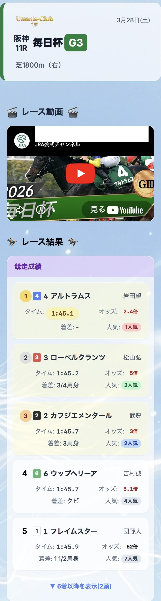

# 🐎 Umania-club

競馬ファン向けのモダンな Web アプリケーションです。レースカレンダーの閲覧、出馬表・オッズ・レース結果（払戻金）の確認、そしてユーザー同士の予想や予想結果を共有できるコミュニティ機能を提供します。

🔗 **[アプリを見る](https://umania-club.vercel.app/)**

---

## 📸 スクリーンショット

| レース一覧 | 予想投稿 | グループ機能 |
|:-----------:|:--------:|:------------:|
|  |  |  |

---

## 🔧 技術スタック

| カテゴリ | 技術 |
|----------|------|
| フロントエンド | Next.js 14 (App Router) / React / TypeScript |
| バックエンド | Firebase Firestore / Firebase Authentication / Firebase Storage |
| デプロイ | Vercel |
| 今後追加予定 | Firebase Functions（自動スクレイピング） |

---

## ✨ 機能一覧

### 🔐 認証
- メールアドレスでの新規登録・ログイン
- プロフィール編集（アイコン画像のアップロード対応）

### 📅 レースカレンダー
- 月ごとのレース一覧をカレンダー形式で表示
- 日付セルをクリックするとその日のレース一覧をモーダルで確認
- JRA スケジュールデータと Firestore データを統合表示

### 🐎 レース情報
- レース詳細ページ（出走馬・枠順・オッズなど）
- 払戻金の表示（単勝・複勝をデフォルト表示、枠連・3連単などはアコーディオン展開）
- Firestore に保存したスクレイピングデータをリアルタイムで表示

### 📝 予想投稿
- レースごとに予想を投稿・共有
- 投稿へのコメント
- 画像付き投稿に対応

### 👥 グループ機能
- グループの作成・参加
- グループ限定の投稿・コメント（可視性制御あり）

---

## 🏗 設計のポイント

- **Custom Hooks による責務分離**
  `usePosts` / `useComments` など、データ取得ロジックをコンポーネントから切り出し

- **ViewModel パターンの採用**
  Firestore のデータ構造と UI の表示ロジックを分離し、保守性を高めた

- **リアルタイム同期**
  Firestore の `onSnapshot` でリアルタイムに投稿・コメントが更新される

- **投稿の可視性制御**
  `public` / `group:xxx` の形式で投稿ごとに公開範囲を管理

---

## 📐 データモデル

### `FirestoreRace`
Firestore に保存される Single Source of Truth です。
Firestore の仕様上 `undefined` を保存できないため、オプショナルな値はすべて `null` として定義されています。

- **`entries`**: レースに出走する馬の基本情報（馬名、性齢、斤量など）
- **`oddsEntries`**: オッズ更新バッチ等で取得される変動データ（オッズ、人気順など）
- **`result`**: レース終了後に保存される着順 (`order`) と払戻金 (`payout`)

### `RaceViewModel`
フロントエンドの UI コンポーネントが実際に利用する統合データモデルです。

- **データの統合**: `FirestoreRace` 内で分かれていた `entries` と `oddsEntries` を、馬番 (`number`) をキーにして1つの `RaceEntryViewModel[]` にマージ
- **UI用プロパティ**: `dateLabel`, `courseLabel`, `gradeStyle` など、コンポーネントで即座に使える整形済み文字列を提供

### `payout`（払戻金）の構造

| キー | 券種 |
|------|------|
| `win` | 単勝 |
| `place` | 複勝 |
| `bracket` | 枠連 |
| `quinella` | 馬連 |
| `wide` | ワイド |
| `exacta` | 馬単 |
| `trio` | 3連複 |
| `trifecta` | 3連単 |

各要素は `numbers`（組番）・`amount`（払戻金）・`popular`（人気）の配列です。

---

## 🗂 ディレクトリ構成

```
src/
├── app/
│   ├── races/          # レース一覧・詳細ページ
│   ├── groups/         # グループ機能
│   └── users/          # ユーザープロフィール
├── components/
│   ├── calendar/       # カレンダーUI（RaceCalendar, CalendarCell など）
│   ├── race/           # レース詳細・出馬表（UnifiedRaceCard, PayoutSection など）
│   ├── community/      # ポスト・予想関連
│   └── prediction/     # 予想入力フォーム
├── hooks/              # Custom Hooks（データ取得ロジック）
├── lib/                # Firebase設定・型定義・定数データ
├── viewmodels/         # ViewModel（表示用データ変換）
├── utils/              # 汎用ユーティリティ関数
└── scripts/
    └── scraper/        # スクレイピングスクリプト群
```

---

## 🚀 ローカルで動かす

### 1. リポジトリをクローン
```bash
git clone https://github.com/wonder954/keiba-forecast-app.git
cd keiba-forecast-app
```

### 2. 依存関係をインストール
```bash
npm install
```

### 3. 環境変数を設定

プロジェクトルートに `.env.local` を作成し、以下を記入してください。
値は Firebase コンソールの「プロジェクトの設定」から確認できます。

```env
NEXT_PUBLIC_FIREBASE_API_KEY=
NEXT_PUBLIC_FIREBASE_AUTH_DOMAIN=
NEXT_PUBLIC_FIREBASE_PROJECT_ID=
NEXT_PUBLIC_FIREBASE_STORAGE_BUCKET=
NEXT_PUBLIC_FIREBASE_MESSAGING_SENDER_ID=
NEXT_PUBLIC_FIREBASE_APP_ID=
NEXT_PUBLIC_FIREBASE_MEASUREMENT_ID=
```

### 4. 開発サーバーを起動
```bash
npm run dev
```

ブラウザで [http://localhost:3000](http://localhost:3000) を開いてください。

---

## 🌐 デプロイ（Vercel）

1. [Vercel](https://vercel.com) にリポジトリを連携
2. Project Settings → Environment Variables に `.env.local` の内容を設定
3. `main` ブランチへの push で自動デプロイされます

---

## 🕷 データ収集（スクレイピング）

レース情報は自作のスクレイピングスクリプトで取得し、Firestore に保存しています。

```bash
# 週末レース情報（出馬表）の取得・オッズの更新
npx tsx scripts/run-friday.ts

# 週末レース情報（登録馬）・先週のレース結果の取得
npx tsx scripts/run-weekly.ts

# オッズのみ更新
npx tsx scripts/run-Odds.ts
```

| スクリプト | タイミング | 内容 |
|-----------|-----------|------|
| `run-friday.ts` | 金・土・日曜 | 週末レース情報（出馬表）の取得・オッズの更新 |
| `run-weekly.ts` | 火曜 | 週末レース情報（登録馬）・先週のレース結果の取得 |
| `run-Odds.ts` | 随時 | オッズのみ更新 |

現在は手動実行ですが、今後 Firebase Functions を使って自動化予定です。

### ⚠️ 開発者向けメモ

- **`typeMap` の注意点**: スクレイピング時の券種マッピングで **「枠連」は `bracket`** にマッピングされます。表記揺れがあるとデータが欠落するため注意してください。
- **`number` 型と `null`**: Firestore は `undefined` を無視するため、オプショナルな項目が未確定の場合は明示的に `null` をセットしてください。馬番 (`number`) は `entries` と `oddsEntries` の統合キーのため、`parseInt` で `NaN` が混入しないよう徹底してください。

---

## 🛠 今後の開発予定

- [ ] **Firebase Functions による自動スクレイピング**
  - 金曜：週末レース情報の取得・更新
  - 火曜：レース結果の更新
  - 土曜夜 / 日曜昼：オッズの更新
- [ ] 勝率・回収率の自動計算と統計表示
- [ ] スクレイパーの堅牢性向上（Playwright による自動テスト）
- [ ] Firestore リードの削減（月ごとのキャッシュ最適化）
- [ ] UI 改善（ガラスモーフィズム / グラデーション）

---

## 👤 作者

- GitHub: [@wonder954](https://github.com/wonder954)

---

## 📄 ライセンス

MIT License