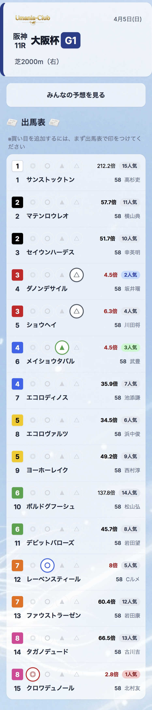
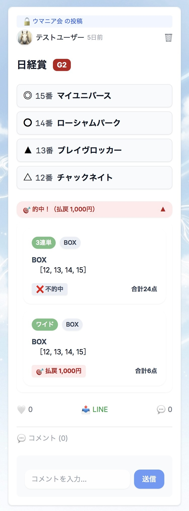

# 🐎 Keiba Forecast App

競馬のレース情報・予想投稿・コメント機能を備えた Web アプリです。  
ユーザー同士で予想を共有したり、レース結果を確認できます。

🔗 **[アプリを見る](https://umania-club.vercel.app/)** <!-- URLを差し替えてください -->

---

## 📸 スクリーンショット

<!-- スクリーンショットを追加すると評価が上がります -->
| レース一覧 | 予想投稿 | グループ機能 |
|:-----------:|:--------:|:------------:|
|  |  |  |

---

## 🔧 技術スタック

| カテゴリ | 技術 |
|----------|------|
| フロントエンド | Next.js 14 (App Router) / React / TypeScript |
| バックエンド | Firebase Firestore / Firebase Authentication / Firebase Storage |
| デプロイ | Vercel |
| 今後追加予定 | Firebase Functions（自動スクレイピング） |

---

## ✨ 機能一覧

### 🔐 認証
- メールアドレスでの新規登録・ログイン
- プロフィール編集（アイコン画像のアップロード対応）

### 📝 予想投稿
- レースごとに予想を投稿・共有
- 投稿へのコメント
- 画像付き投稿に対応

### 🐎 レース情報
- レース一覧・詳細ページ（出走馬・枠順など）
- Firestore に保存したスクレイピングデータを表示

### 👥 グループ機能
- グループの作成・参加
- グループ限定の投稿・コメント（可視性制御あり）

---

## 🏗 設計のポイント

実務を意識して以下の点を工夫しました。

- **Custom Hooks による責務分離**  
  `usePosts` / `useComments` など、データ取得ロジックをコンポーネントから切り出し

- **ViewModel パターンの採用**  
  Firestore のデータ構造と UI の表示ロジックを分離し、保守性を高めた

- **リアルタイム同期**  
  Firestore の `onSnapshot` でリアルタイムに投稿・コメントが更新される

- **投稿の可視性制御**  
  `public` / `group:xxx` の形式で投稿ごとに公開範囲を管理

---

## 🗂 ディレクトリ構成
```
src/
├── app/
│   ├── races/          # レース一覧・詳細ページ
│   ├── groups/         # グループ機能
│   └── users/          # ユーザープロフィール
├── components/         # 再利用可能な UI コンポーネント
├── hooks/              # Custom Hooks（データ取得ロジック）
├── lib/                # Firebase 設定・外部ライブラリ
├── viewmodels/         # ViewModel（表示用データ変換）
├── types/              # TypeScript 型定義
└── utils/              # 汎用ユーティリティ関数
```

---

## 🚀 ローカルで動かす

### 1. リポジトリをクローン
```bash
git clone https://github.com/your-username/keiba-forecast-app.git
cd keiba-forecast-app
```

### 2. 依存関係をインストール
```bash
npm install
```

### 3. 環境変数を設定

プロジェクトルートに `.env.local` を作成し、以下を記入してください。  
値は Firebase コンソールの「プロジェクトの設定」から確認できます。
```env
NEXT_PUBLIC_FIREBASE_API_KEY=
NEXT_PUBLIC_FIREBASE_AUTH_DOMAIN=
NEXT_PUBLIC_FIREBASE_PROJECT_ID=
NEXT_PUBLIC_FIREBASE_STORAGE_BUCKET=
NEXT_PUBLIC_FIREBASE_MESSAGING_SENDER_ID=
NEXT_PUBLIC_FIREBASE_APP_ID=
NEXT_PUBLIC_FIREBASE_MEASUREMENT_ID=
```

### 4. 開発サーバーを起動
```bash
npm run dev
```

ブラウザで [http://localhost:3000](http://localhost:3000) を開いてください。

---

## 🌐 デプロイ（Vercel）

本番環境は Vercel を使用しています。

1. [Vercel](https://vercel.com) にリポジトリを連携
2. Project Settings → Environment Variables に `.env.local` の内容をそのまま設定
3. `main` ブランチへの push で自動デプロイされます

---

## 🕷 データ収集（スクレイピング）

レース情報は自作のスクレイピングスクリプトで取得し、Firestore に保存しています。
```bash
# 週末レース情報（出馬表）の取得・オッズの更新
npx tsx scripts/run-friday.ts

# 週末レース情報（登録馬）・先週のレース結果の取得
npx tsx scripts/run-weekly.ts
```

現在は手動実行ですが、今後 Firebase Functions を使って自動化予定です。

| スクリプト | タイミング | 内容 |
|-----------|-----------|------|
| `run-friday.ts` | 金・土・日曜 | 週末レース情報（出馬表）の取得・オッズの更新 |
| `run-weekly.ts` | 火曜 | 週末レース情報（登録馬）・先週のレース結果の取得 |

---

## 🛠 今後の開発予定

- [ ] **Firebase Functions による自動スクレイピング**
  - 金曜：週末レース情報の取得・更新
  - 火曜：レース結果の更新
  - 土曜夜 / 日曜昼：オッズの更新
- [ ] 勝率・回収率の自動計算と統計表示
- [ ] UI 改善（ガラスモーフィズム / グラデーション）

---

## 👤 作者

- GitHub: [@wonder954](https://github.com/wonder954)

---

## 📄 ライセンス

MIT License